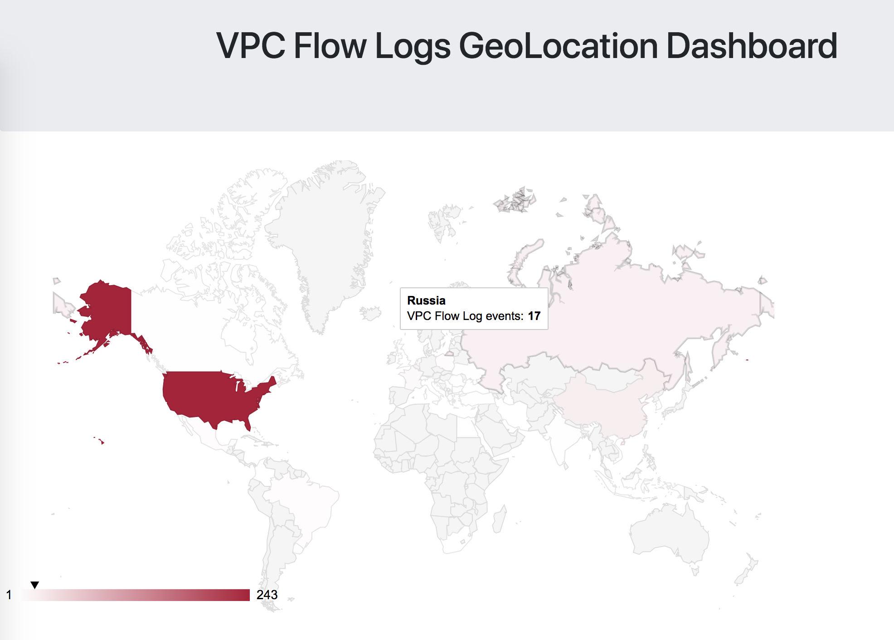

# IpGeoLocatorDashboard
Small PoC to analyze AWS VPC Flow Logs in near real-time by enriching IP address info with geolocation metadata

### Scenario

I've been using VPC Flow Logs for analytics for a while, and I've even written some analytics tools using AWS Athena & Glue to issue queries via SQL to aggregate throughput metrics. Occasionally I'll look at the logs and notice the various access attempts to my resources, and how those attempts span the globe. 

I thought an interesting experiment would be to visualize *where* various access attempts to my AWS VPC resources are coming from. 

### Architecture

TODO: architecture visualization 

VPC Flow Logs are the core of this architecture. They get streamed via a CloudWatch Logs subscription to a Lambda function. That Lambda function JSONifies they payload, and then enriches the entry with geolocation data; the function then publishes that payload to an MQTT topic in AWS IoT. 

Why AWS IoT? Because we can access that message stream in a browser using MQTT over WebSockets! For access, I use a Cognito Identity Pool (in unauthenticated access mode), which will vend temporary AWS credentials for accessing the AWS IoT service endpoint. 

### Visualization

Visualization is a pretty basic affair - we're doing everything in the browser via the AWS JavaScript SDK, a Paho MQTT client, Google Geocharts, and a few addtional support scripts. At time of writing this (June 8, 2018), the dashboard simply visualizes the incoming stream of events on a world map. It looks like so: 

